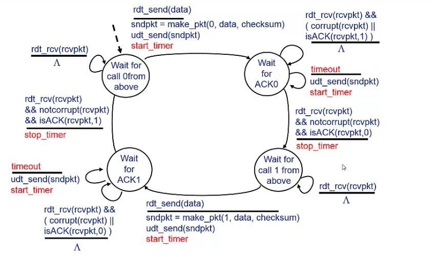
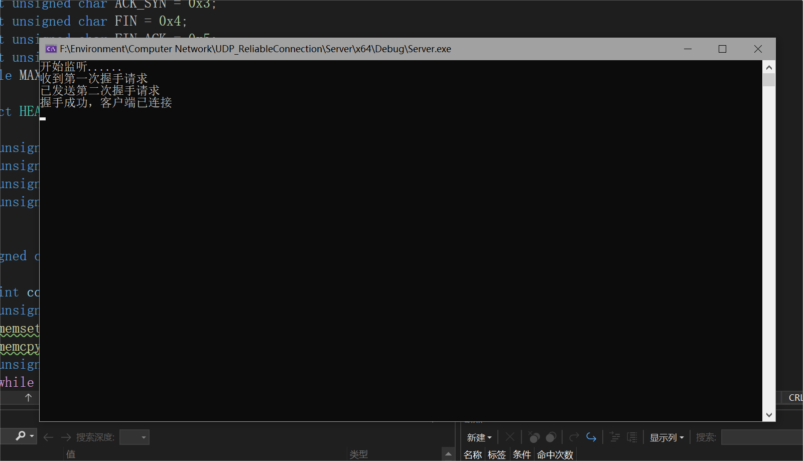
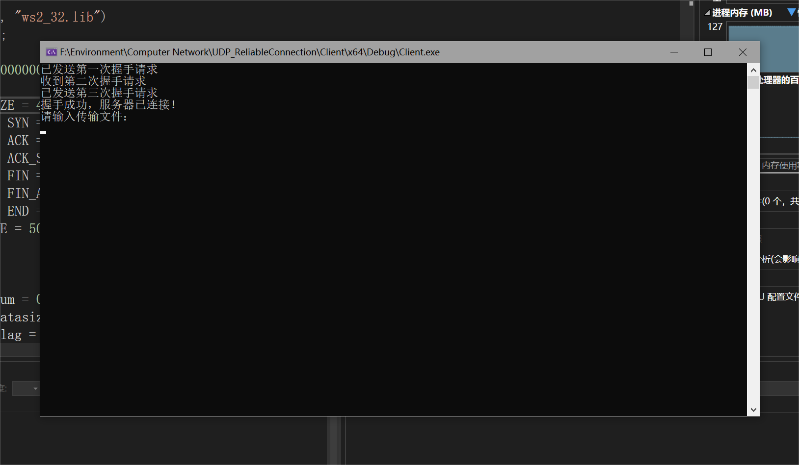
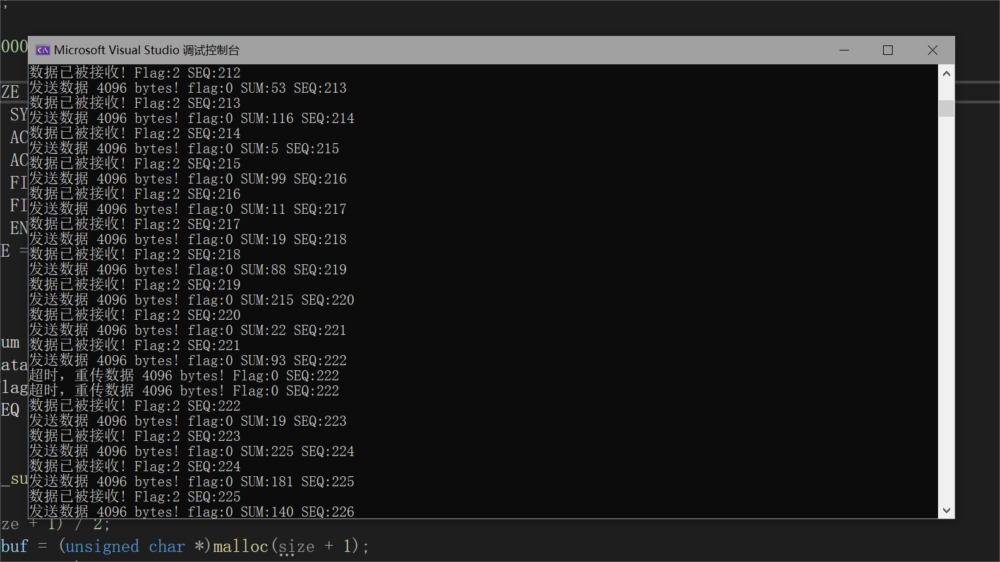
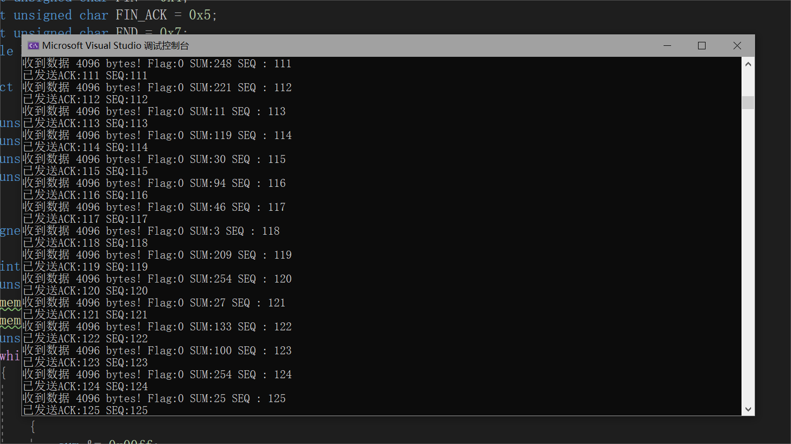
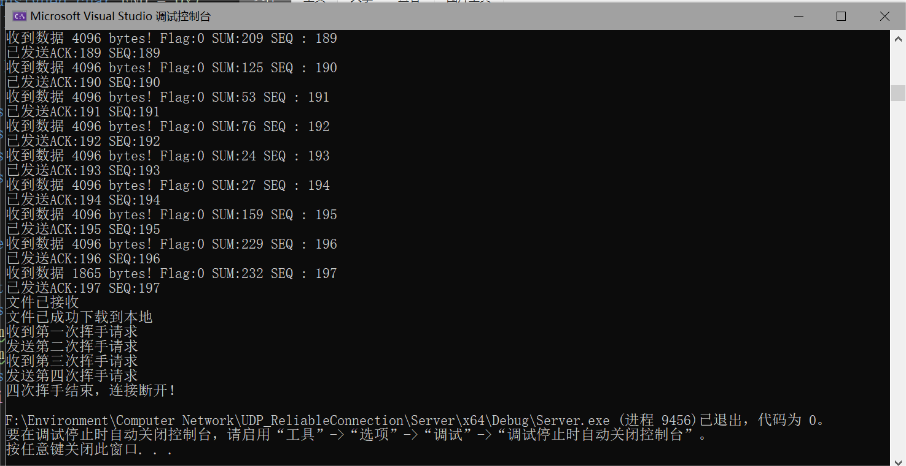
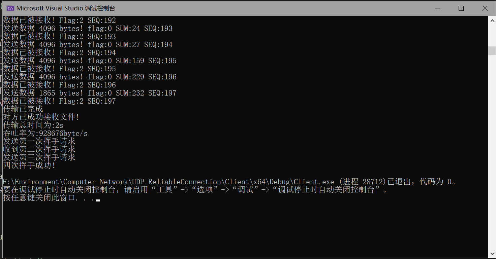

# 编程作业3-1实验报告 # 
## 实验名称：基于UDP服务设计可靠传输协议并编程实现 ##
#### 2011181 唐鹏程 ####
&nbsp;

## 一. 实验要求 ##

利用数据报套接字在用户空间实现面向连接的可靠数据传输，功能包括：建立连接、差错检测、确认重传等。流量控制采用停等机制，完成给定测试文件的传输。

* 数据报套接字：UDP
* 建立连接：实现类似TCP的握手、挥手功能
* 差错检测：计算校验和
* 确认重传：rdt2.0、rdt2.1、rdt2.2、rdt3.0等，亦可自行设计协议
* 单向传输：发送端、接收端
* 有必要日志输出

## 二. 实验原理 ##

* UDP: 即User Datagram Protocol，时一种用户数据报协议，又称用户数据报文协议，是一个简单的面向数据报的传输层协议，正式规范为RFC 768。是一种非连接协议。它一旦把应用层发给网络层的数据发送出去，就不保留数据备份，因此是一种不可靠协议。发送端生产数据，接收端从网络中抓取数据。UDP优点主要是结构简单、无校验、速度快、容易丢包、可广播。

### 协议设计 ### 
1. 数据报文格式：

    报文头部：长度为48位

    1-16位为数据长度，记录数据的大小

    17-32位为校验和，用于检验传输的正确性

    33-40位为标志位，用于识别FIN，ACK，SYN等标志

    41-48位为序列号，范围在0-255

2. 三次握手

    三次握手的流程可以形象地用下图表示：

    

    具体协议为：
    
    * 客户端首先向服务端发送第一次握手请求，SYN=1

    * 服务端收到第一次握手请求后，向客户端发送第二次握手请求，ACK=1

    * 客户端收到第二次握手请求后，向服务端发送第三次握手请求，SYN=1，ACK=1

    * 服务端收到第三次握手请求后，成功建立连接

3. 四次挥手

    四次挥手也同理：

    * 客户端首先向服务端发送第一次挥手请求，FIN=1

    * 服务端收到第一次挥手请求后，向客户端发送第二次挥手请求，ACK=1

    * 客户端收到第二次挥手请求后，向服务端发送第三次挥手请求，FIN=1，ACK=1

    * 服务端收到第三次挥手请求后，向客户端发送第四次挥手请求，FIN=1，ACK=1

    * 客户端收到第四次挥手请求后，连接断开

4. 超时重传：在发送数据报文段后开始计时，到等待确认应答到来的那个时间间隔。如果超过这个时间间隔，仍未收到确认应答，发送端将进行数据重传。

5. 确认重传：rdt3.0协议

    rdt3.0协议的状态机如下图所示：

    

    数据传输的方式为将文件分为多个固定大小的数据包进行分段传输，每个数据包都包含头部和数据部分。发送端在传输过程中需要在接收到上一个发送包序列号的ACK确认后，才能发送下一个数据包。而接收端接收到了一个数据包，先要进行校验，再发送该序列号的ACK确认。在一定时间内，如果发送端没有收到该序列号的ACK确认，将会重新传输该数据包。如果接收端收到了重复的数据包，将其中一个丢弃，但仍需要向发送方发送该序列号的ACK确认。传输结束后，发送端需要向接收端发送一个FIN=1，ACK=1，SYN=1的数据包，表示文件传输结束，接收端收到该包后向发送方返回一个ACK确认，表示收到文件传输结束的信号。

## 三. 实验代码 ##
1. 计算校验和

    对一个无符号数，先求其反码，然后从低位到高位按位相加，若最高位有进位，则向最低位进1。
    
    特点：关于二进制反码循环移位求和运算需要说明的一点是，先取反后相加与先相加后取反，得到的结果是一样的。

    * 发送方生成校验和：
    
        * 将待发送数据分成若干个8位的位串，每个位串看成一个二进制数，这里并不管位串代表什么，可以是整数、浮点数、或者位图；

        * 将IP、UDP、TCP的PDU首部中的校验和字段置为0，该字段也参与校验和运算；

        * 对这些8位的二进制数进行1的补码和运算，累加的结果再取反码即生成了校验码，将校验码放入校验和字段中。

    * 接收方校验校验和：

        * 接收方将接收的数据（包括校验和字段）按发送方同样的方法进行1的补码和运算，累加的结果再取反码；
        
        * 校验，如果上步的结果为0，表示传输正确；否则传输出错。

    ```c
    unsigned short check_sum(unsigned short *message, int size)
    {
        int count = (size + 1) / 2;
        unsigned short *buf = (unsigned short *)malloc(size + 1);
        memset(buf, 0, size + 1);
        memcpy(buf, message, size);
        unsigned long sum = 0;
        while (count--)
        {
            sum += *buf++;
            if (sum & 0xffff0000)
            {
                sum &= 0xffff;
                sum++;
            }
        }
        return ~(sum & 0xffff);
    }
    ```

2. 三次握手与四次挥手

    建立连接、数据传输和断开连接都根据上文所述的协议逐步实现即可

## 四.实验结果 ##
* 三次握手，建立连接：
    
      

    

* 文件传输：

    

    

* 四次挥手，断开连接：

    

    

### 源码链接：https://github.com/Donnykk/Computer_Network/tree/main/UDP_ReliableConnection ###