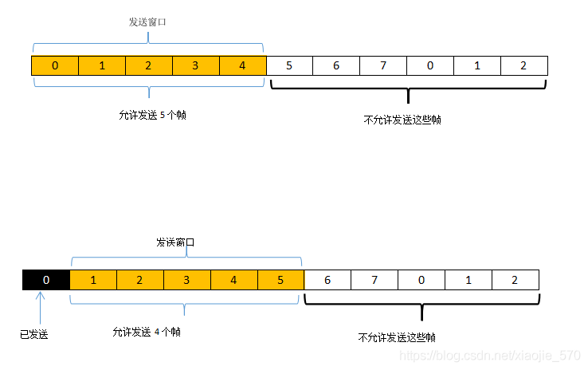

# 编程作业3-2实验报告 # 
## 实验名称：基于UDP服务设计可靠传输协议并编程实现 ##
#### 2011181 唐鹏程 ####
&nbsp;

## 一. 实验要求 ##

在实验3-1的基础上，将停等机制改成`基于滑动窗口的流量控制机制`，采用固定窗口大小，支持累积确认，完成给定测试文件的传输。

* 多个序列号
* 发送缓冲区、接受缓冲区
* 滑动窗口：Go Back N
* 有必要日志输出

## 二. 实验原理 ##

* UDP: 即User Datagram Protocol，时一种用户数据报协议，又称用户数据报文协议，是一个简单的面向数据报的传输层协议，正式规范为RFC 768。是一种非连接协议。它一旦把应用层发给网络层的数据发送出去，就不保留数据备份，因此是一种不可靠协议。发送端生产数据，接收端从网络中抓取数据。UDP优点主要是结构简单、无校验、速度快、容易丢包、可广播。

### 协议设计 ### 
1. 数据报文格式：

    报文头部：长度为48位

    1-16位为数据长度，记录数据的大小

    17-32位为校验和，用于检验传输的正确性

    33-40位为标志位，用于识别FIN，ACK，SYN等标志

    41-48位为序列号，范围在0-255

2. 三次握手

    三次握手的流程可以形象地用下图表示：

    

    具体协议为：
    
    * 客户端首先向服务端发送第一次握手请求，SYN=1

    * 服务端收到第一次握手请求后，向客户端发送第二次握手请求，ACK=1

    * 客户端收到第二次握手请求后，向服务端发送第三次握手请求，SYN=1，ACK=1

    * 服务端收到第三次握手请求后，成功建立连接

3. 四次挥手

    四次挥手也同理：

    * 客户端首先向服务端发送第一次挥手请求，FIN=1

    * 服务端收到第一次挥手请求后，向客户端发送第二次挥手请求，ACK=1

    * 客户端收到第二次挥手请求后，向服务端发送第三次挥手请求，FIN=1，ACK=1

    * 服务端收到第三次挥手请求后，向客户端发送第四次挥手请求，FIN=1，ACK=1

    * 客户端收到第四次挥手请求后，连接断开

4. 滑动窗口（`Go Back N` 协议）

    滑动窗口（Sliding Window）是一种流量控制技术。在先前实现的网络通信中，客户端不会考虑网络的拥挤情况直接发送数据。由于不知道网络拥塞状况，同时发送数据，导致中间节点阻塞掉包，这是需要解决的重要问题。滑动窗口机制就可以用来解决此问题。滑动窗口的示意图如下所示：

    

    * 发送窗口：在任意时刻，发送方都维持一组连续的允许发送的帧的序号，称为发送窗口。

    * 接收窗口：在接收端设置接收窗口是为了控制可以接受哪些数据帧而不可以接收哪些帧。在接收方只有当收到的数据帧的序号落入接收窗口内才允许将该数据帧接收。若接收到的数据帧落在了接收窗口之外，则一律将其丢弃。

    * 在发送端，每收到一个有效的ACK确认，发送窗口就向前滑动一个帧的位置，当发送窗口内没有可以发送的帧，发送方就会停止发送进入等待，直到收到接收方发送的确认帧使窗口移动，窗口内有可以发送的帧，之后才开始继续发送。

    * 本实验所采用的`Go Back N`滑动窗口协议，即为发送窗口大小 > 1，接收窗口大小 = 1的滑动窗口协议。

        &nbsp;

        发送方不需要在收到上一帧的ACK后才能开始发送下一帧。当接收方检测出失序的信息帧之后，要求发送方重发最后一个正确信息帧之后的所有未被确认的帧；或者当发送方发送了N个帧之后，若发现该N帧的前一个帧在计时器超时后仍未返回其确认信息，则该帧被判定为出错或者丢失，此时发送方就不得不重传该出错帧及之后的N个帧。
        
        `注意：接收方只允许按照顺序确认帧。`

        &nbsp;

        为了减少开销，后退N帧协议还规定接收端不一定每收到一个正确的数据帧就必须立即发回一个确认，而是可以在连续收到好几个正确的数据帧后，才对最后一个数据帧发送确认信息，或者可以在当自己有数据要发送的时候才将对以前正确收到的帧加以捎带确认。

        &nbsp;

        具体流程如下所示：

        

## 三. 实验代码 ##

#### 发送端 
    
```c
    void Send_Message(SOCKET &socketClient, SOCKADDR_IN &server_addr, int &server_addr_len, char *message, int len)
    {
        int package_num = len / BUFFER_SIZE + (len % BUFFER_SIZE != 0); //数据包数量
        HEADER header;
        char *buffer = new char[sizeof(header)];
        int first_pos = -1, last_pos = 0;
        clock_t start;
        while (first_pos < package_num - 1)
        {
            int pack_len = 0;
            if (last_pos - first_pos < MAX_WINDOW)
            {
                //若窗口未满，直接发送数据包即可
                HEADER header;
                char *buffer = new char[BUFFER_SIZE + sizeof(header)];
                if (last_pos == package_num - 1)
                    pack_len = len - (package_num - 1) * BUFFER_SIZE;
                else
                    pack_len = BUFFER_SIZE;
                header.SEQ = unsigned char(last_pos % 256);
                header.datasize = pack_len;
                memcpy(buffer, &header, sizeof(header));
                memcpy(buffer + sizeof(header), message + last_pos * BUFFER_SIZE, pack_len);
                header.sum = check_sum((unsigned short *)buffer, sizeof(header) + pack_len);
                memcpy(buffer, &header, sizeof(header));
                sendto(socketClient, buffer, pack_len + sizeof(header), 0, (sockaddr *)&server_addr, server_addr_len);
                cout << "发送信息 " << len << " bytes! SEQ:" << int(header.SEQ) << endl;
                start = clock();
                last_pos++;
            }
            //变为非阻塞模式
            unsigned long mode = 1;
            ioctlsocket(socketClient, FIONBIO, &mode);
            if (recvfrom(socketClient, buffer, BUFFER_SIZE, 0, (sockaddr *)&server_addr, &server_addr_len))
            {
                memcpy(&header, buffer, sizeof(header));
                if (check_sum((unsigned short *)&header, sizeof(header)) == 0)
                {
                    if (header.SEQ > first_pos % 256) // ACK对应序列号有效
                        first_pos += int(header.SEQ) - first_pos % 256;
                    else if (header.SEQ < MAX_WINDOW && first_pos % 256 + MAX_WINDOW >= 256) //窗口横跨两个256序列号组
                        first_pos += int(header.SEQ) - first_pos % 256 + 256;
                    else
                        continue; //忽略重复ACK
                    cout << "发送已被确认! SEQ:" << int(header.SEQ) << endl;
                    cout << "窗口：" << first_pos << "~" << first_pos + MAX_WINDOW << endl;
                }
                else
                {
                    //校验和出错，丢弃未确认数据包
                    last_pos = first_pos + 1;
                    cout << "校验错误！已丢弃未确认数据包" << endl;
                    continue;
                }
            }
            else
            {
                clock_t present = clock();
                if (present - start > MAX_WAIT_TIME)
                {
                    last_pos = first_pos + 1;
                    cout << "确认超时，开始重传...";
                }
            }
            mode = 0;
            ioctlsocket(socketClient, FIONBIO, &mode);
        }
        //发送结束信息
        header.flag = END;
        header.sum = 0;
        header.sum = check_sum((unsigned short *)&header, sizeof(header));
        memcpy(buffer, &header, sizeof(header));
        sendto(socketClient, buffer, sizeof(header), 0, (sockaddr *)&server_addr, server_addr_len);
        cout << "已发送结束请求!" << endl;
        start = clock();
        while (true)
        {
            unsigned long mode = 1;
            ioctlsocket(socketClient, FIONBIO, &mode);
            while (recvfrom(socketClient, buffer, BUFFER_SIZE, 0, (sockaddr *)&server_addr, &server_addr_len) <= 0)
            {
                clock_t present = clock();
                if (present - start > MAX_WAIT_TIME)
                {
                    char *buffer = new char[sizeof(header)];
                    header.flag = END;
                    header.sum = 0;
                    header.sum = check_sum((unsigned short *)&header, sizeof(header));
                    memcpy(buffer, &header, sizeof(header));
                    sendto(socketClient, buffer, sizeof(header), 0, (sockaddr *)&server_addr, server_addr_len);
                    cout << "发送超时! 开始重传..." << endl;
                    start = clock();
                }
            }
            memcpy(&header, buffer, sizeof(header));
            if (check_sum((unsigned short *)&header, sizeof(header)) == 0)
            {
                //校验和正确
                if (header.flag == END)
                {
                    cout << "对方已成功接收文件!" << endl;
                    break;
                }
                else
                {
                    continue;
                }
            }
            else
            {
                //校验失败，重传
                header.flag = END;
                header.sum = 0;
                header.sum = check_sum((unsigned short *)&header, sizeof(header));
                memcpy(buffer, &header, sizeof(header));
                sendto(socketClient, buffer, sizeof(header), 0, (sockaddr *)&server_addr, server_addr_len);
                cout << "校验失败，已重新发送结束请求!" << endl;
                start = clock();
            }
        }
        unsigned long mode = 0;
        ioctlsocket(socketClient, FIONBIO, &mode);
    }
```

#### 接收端

```c
    int Receive_message(SOCKET &socketServer, SOCKADDR_IN &client_addr, int &client_addr_len, char *message)
    {
        HEADER header;
        char *buffer = new char[BUFFER_SIZE + sizeof(header)];
        int seq = 0; //序列号
        int len = 0; //已读取长度
        while (true)
        {
            int mess_len = 0;
            if (mess_len = recvfrom(socketServer, buffer, sizeof(header) + BUFFER_SIZE, 0, (sockaddr *)&client_addr, &client_addr_len))
            {
                memcpy(&header, buffer, sizeof(header));
                if (header.flag == 0)
                {
                    if (int(header.SEQ) == seq)
                    {
                        char *temp_buffer = new char[mess_len - sizeof(header)];
                        memcpy(temp_buffer, buffer + sizeof(header), mess_len - sizeof(header));
                        memcpy(message + len, temp_buffer, mess_len - sizeof(header));
                        len = len + int(header.datasize);
                        cout << "已接收数据 " << mess_len - sizeof(header) << " bytes! SEQ: " << int(header.SEQ) << endl;
                        //发送ACK
                        header.flag = ACK;
                        header.datasize = 0;
                        header.SEQ = (unsigned char)seq;
                        header.sum = 0;
                        header.sum = check_sum((unsigned short *)&header, sizeof(header));
                        memcpy(buffer, &header, sizeof(header));
                        // Sleep(10); //模拟传输延迟
                        if (sendto(socketServer, buffer, sizeof(header), 0, (sockaddr *)&client_addr, client_addr_len) == SOCKET_ERROR)
                        {
                            return SOCKET_ERROR;
                        }
                        cout << "已发送ACK! SEQ:" << (int)header.SEQ << endl;
                        //增加当前序列号
                        seq++;
                        if (seq >= 256)
                            seq -= 256;
                    }
                    else
                    {
                        //序列号不匹配
                        header.flag = ACK;
                        header.datasize = 0;
                        header.SEQ = (unsigned char)(seq - 1);
                        header.sum = 0;
                        header.sum = check_sum((unsigned short *)&header, sizeof(header));
                        memcpy(buffer, &header, sizeof(header));
                        //重发该包的ACK
                        if (sendto(socketServer, buffer, sizeof(header), 0, (sockaddr *)&client_addr, client_addr_len) == SOCKET_ERROR)
                        {
                            return SOCKET_ERROR;
                        }
                        cout << "已发送ACK! SEQ:" << (int)header.SEQ << endl;
                        continue;
                    }
                }
                else if (header.flag == END && check_sum((unsigned short *)&header, sizeof(header)) == 0)
                {
                    cout << "文件已接收完毕！" << endl;
                    break;
                }
            }
        }
        header.flag = END;
        header.sum = 0;
        header.sum = check_sum((unsigned short *)&header, sizeof(header));
        memcpy(buffer, &header, sizeof(header));
        if (sendto(socketServer, buffer, sizeof(header), 0, (sockaddr *)&client_addr, client_addr_len) == SOCKET_ERROR)
        {
            return SOCKET_ERROR;
        }
        return len;
    }
```

## 四. 实验结果 ##
 


###### 源码链接：https://github.com/Donnykk/Computer_Network/tree/main/UDP_ReliableConnection