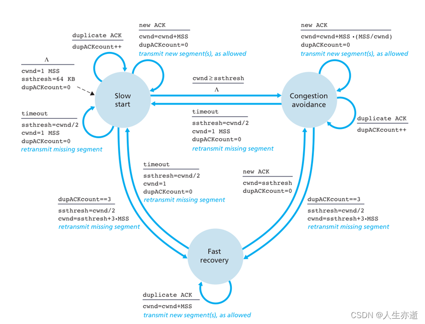
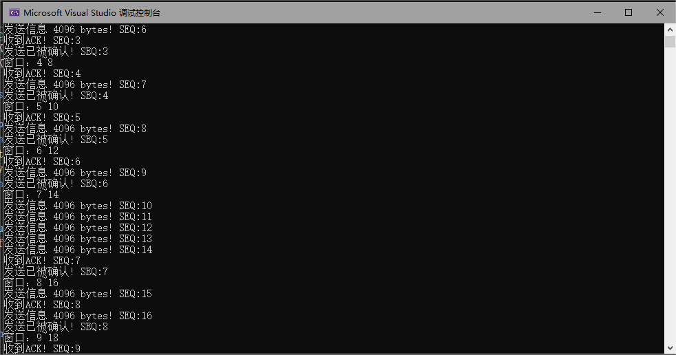
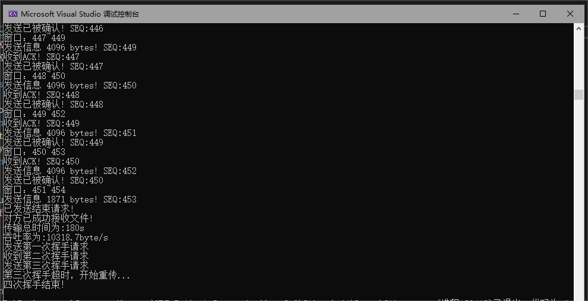
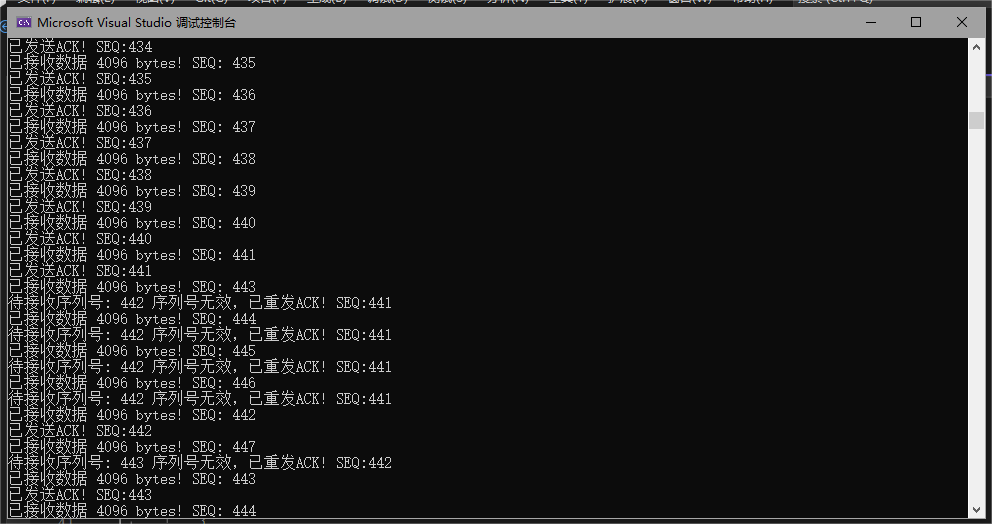

# 编程作业3-3实验报告 # 
## 实验名称：基于UDP服务设计可靠传输协议并编程实现 ##
#### 2011181 唐鹏程 ####
&nbsp;

## 一. 实验要求 ##

在实验3-2的基础上，选择实现一种拥塞控制算法，也可以是改进的算法，完成给定测试文件的传输。

* RENO算法；
* 也可以自行设计协议或实现其他拥塞控制算法；
* 给出实现的拥塞控制算法的原理说明；
* 有必要日志输出（须显示窗口大小改变情况）。

## 二. 实验原理 ##

* UDP: 即User Datagram Protocol，时一种用户数据报协议，又称用户数据报文协议，是一个简单的面向数据报的传输层协议，正式规范为RFC 768。是一种非连接协议。它一旦把应用层发给网络层的数据发送出去，就不保留数据备份，因此是一种不可靠协议。发送端生产数据，接收端从网络中抓取数据。UDP优点主要是结构简单、无校验、速度快、容易丢包、可广播。

### 协议设计 ### 
##### 1. 拥塞控制
    
在某段时间，若对网络中某一资源的需求超过了该资源所能提供的可用部分，网络性能就要变坏，这种情况就叫做网络拥塞。在计算机网络中数位链路容量（即带宽）、交换结点中的缓存和处理机等，都是网络的资源。若出现拥塞而不进行控制，整个网络的吞吐量将随输入负荷的增大而下降。

* 目标：既不造成网络严重拥塞，又能更快地传输数据

* 带宽探测：接收到ACK，高传输速率；发生丢失事件，降低传输速率
&nbsp;

##### 2. TCP Reno拥塞控制算法

TCP Reno 就是广受赞誉的TCP拥塞控制算法，该算法主要由三部分组成：慢启动、拥塞避免、快速回复。

###### （1） 慢启动

* 慢启动是建立TCP连接后，采用的第一个调整发送速率的算法（模式）。在这个阶段，cwnd通常被初始化为1MSS，用于对TCP发送方而言，可用带宽可能比MSS/RTT大的多，慢启动的目的就是尽快找到上限。

* 在慢启动阶段，发送方每接收到一个确认报文，就会将cwnd增加1MSS的大小，于是其情况就为：

    * 初始cwnd=1MSS，所以可发送一个TCP最大报文段，成功确认后，cwnd = 2MSS；
        
    * 此时可发送两个TCP最大报文段，成功接收后，cwnd = 4 MSS；
        
    * 此时可发送四个TCP最大报文段，成功接收后，cwnd = 8 MSS ……
&nbsp;
* 由于TCP是一次性将窗口内的所有报文发出，所以所有报文都到达并被确认的时间，近似的等于一个RTT。所以在这个阶段，拥塞窗口cwnd的长度将在每过一个RTT后，发送速率翻倍。因此TCP发送速率起始慢，但在慢启动发送速率将以指数级别增长。那在这个过程中何时结束这种指数增长，这又分几种情况：

    * 第一种：若在慢启动的过程中，发生了数据传输超时(timeout)，则此时TCP将ssthresh的值设置为cwnd / 2，然后将cwnd重新设置为1MSS，重新开始慢启动过程，这个过程可以理解为试探上限；

    * 第二种：第一步试探出来的上限ssthresh将用在此处。若cwnd的值增加到>= ssthresh时，此时若继续使用慢启动的翻倍增长方式可能过于鲁莽，所以这个时候结束慢启动，改为拥塞避免模式；
        
    * 第三种：若发送方接收到了某个报文的三次冗余ACK（即触发了快速重传的条件），则进入到快速恢复阶段；同时，ssthresh = cwnd / 2，然后cwnd = ssthresh + 3MSS；

###### （2） 拥塞避免

* 刚进入拥塞避免模式时，cwnd的大小近似的等于上次拥塞时的值的一半，即距离拥塞可能并不遥远。所以，拥塞避免是一个速率缓慢且线性增长的过程，在这个模式下，每经历一个RTT，cwnd的大小增加1MSS。也就是说，假设cwnd包含10个报文的大小，则每接收到一个确认报文，cwnd增加1/10 MSS，因此在收到对所有10个报文段的确认后，拥塞窗口的值将增加一个MSS。那在这个过程中何时结束这种线性增长，这又分几种情况：

    * 第一种：在这个过程中，发生了超时，则表示网络拥塞，这时候，ssthresh被修改为cwnd / 2，然后cwnd被置为1MSS，并进入慢启动阶段；
        
    * 第二种：若发送方接收到了某个报文的三次冗余ACK（即触发了快速重传的条件），此时也认为发生了拥塞, 则进入到快速恢复阶段；同时，ssthresh = cwnd / 2，然后cwnd = ssthresh + 3MSS；

###### （3） 快速恢复

* 在快速恢复阶段，每接收到一个冗余的确认报文，cwnd就增加1MSS，其余不变，而当发生以下两种情况时, 将退出快速恢复模式:

    * 第一种：在快速恢复过程中，计时器超时，那么ssthresh被修改为 cwnd / 2，然后cwnd被置为1MSS，并进入慢启动阶段；

    * 第二种：若发送方接收到一条新的确认报文（不是冗余ACKS），则cwnd被置为ssthresh，然后进入到拥塞避免模式；

&nbsp;
###### 三种状态间的转换如下图所示：



&nbsp;
##### 3. 多线程

前两次实验都未使用多线程，使传输效率不够理想，本次实验将`client`端的发送与接收分为两个线程进行，用`mutex`API可以进行加锁和解锁，在日志的输入输出以及缓冲区的加载时都应进行加锁和解锁以确保多线程间操作顺序进行，以发送数据包为主线程，同时开辟接收数据线程来处理`server`端传来的ACK即可。

## 三. 实验代码 ##

#### 发送端 
为接收数据单独创建线程函数：    

```c
void Receive_Message(SOCKET *socketClient, SOCKADDR_IN *server_addr)
{
    int server_addr_len = sizeof(SOCKADDR_IN);
    HEADER header;
    char *buffer = new char[sizeof(header)];
    int step = 0; // 拥塞避免确认数
    int dup = 0;  // 重复ACK数
    // 变为非阻塞模式
    unsigned long mode = 1;
    ioctlsocket(*socketClient, FIONBIO, &mode);
    while (sending)
    {
        int num = 0;
        while (recvfrom(*socketClient, buffer, sizeof(header), 0, (sockaddr *)server_addr, &server_addr_len) < 0)
        {
            if (!sending)
            {
                // 主线程发送完毕
                mode = 0;
                ioctlsocket(*socketClient, FIONBIO, &mode);
                return;
            }
            if (timer.is_time_out())
            {
                // 超时重传
                dup = 0;
                ssthresh = cwnd / 2;
                cwnd = 1;
                state = Slow_Start;
                for (auto package : GBN_BUFFER)
                {
                    sendto(*socketClient, (char *)package, package->header.datasize + sizeof(HEADER), 0,
                           (sockaddr *)server_addr, server_addr_len);
                    LOCK_PRINT.lock();
                    cout << "超时重传，SEQ:" << package->header.SEQ << endl;
                    LOCK_PRINT.unlock();
                }
                timer.start_();
            }
        }
        memcpy(&header, buffer, sizeof(header));
        if (check_sum((char *)&header, sizeof(header)) == 0)
        {
            if (int(header.SEQ) < first_pos)
            {
                // 收到冗余ACK
                if (state == Quick_Recover)
                    cwnd++;
                dup++;
                if (dup == 3)
                {
                    if (state == Slow_Start || state == Congestion_Avoid)
                    {
                        state = Quick_Recover;
                        ssthresh = cwnd / 2;
                        cwnd = ssthresh + 3;
                    }
                    Package *p = GBN_BUFFER[0];
                    sendto(*socketClient, (char *)p, p->header.datasize + sizeof(HEADER), 0, (sockaddr *)server_addr, server_addr_len);
                    LOCK_PRINT.lock();
                    cout << "收到3个重复ACK，开始重传，SEQ:" << p->header.SEQ << endl;
                    LOCK_PRINT.unlock();
                }
            }
            else if (int(header.SEQ) >= first_pos)
            {
                // 收到正确ACK，更新窗口大小
                cout << "收到ACK! SEQ:" << int(header.SEQ) << endl;
                if (state == Slow_Start)
                {
                    cwnd++;
                    if (cwnd >= ssthresh)
                        // 进入拥塞避免阶段
                        state = Congestion_Avoid;
                }
                else if (state == Congestion_Avoid)
                {
                    step++;
                    if (step >= cwnd)
                    {
                        step = 0;
                        cwnd++;
                    }
                }
                else
                {
                    // 快速恢复
                    cwnd = ssthresh;
                    state = Congestion_Avoid;
                    step = 0;
                }
                // 更新窗口位置
                int count = int(header.SEQ) - first_pos + 1;
                for (int i = 0; i < count; i++)
                {
                    LOCK_BUFFER.lock();
                    if (GBN_BUFFER.size() <= 0)
                        break;
                    delete GBN_BUFFER[0];
                    GBN_BUFFER.erase(GBN_BUFFER.begin());
                    LOCK_BUFFER.unlock();
                }
                first_pos = header.SEQ + 1;
                LOCK_PRINT.lock();
                cout << "发送已被确认! SEQ:" << int(header.SEQ) << endl;
                cout << "窗口：" << first_pos << "~" << first_pos + cwnd - 1 << endl;
                LOCK_PRINT.unlock();
            }
        }
        else
        {
            LOCK_PRINT.lock();
            cout << "校验和出错！" << endl;
            LOCK_PRINT.unlock();
            continue;
        }
        // 重启计时器
        if (first_pos < last_pos)
        {
            timer.start_();
            cout << "timer" << endl;
        }
    }
}
```
将发送数据包作为主线程：

```c
void Send_Message(SOCKET *socketClient, SOCKADDR_IN *server_addr, int &server_addr_len, char *message, int len)
{
    int package_num = len / BUFFER_SIZE + (len % BUFFER_SIZE != 0); // 数据包数量
    HEADER header;
    char *buffer = new char[sizeof(header)];
    sending = true;
    thread Receive_Thread(Receive_Message, socketClient, server_addr);
    for (int i = 0; i < len; i += BUFFER_SIZE)
    {
        while (last_pos - first_pos >= MAX_WINDOW || last_pos - first_pos >= cwnd)
            continue; // 阻塞
        Package *package = new Package;
        int pack_len = BUFFER_SIZE;
        if (i + BUFFER_SIZE > len)
            pack_len = len - i;
        package->header.datasize = pack_len;
        package->header.sum = 0;
        package->header.SEQ = last_pos;
        memcpy(package->data, message + i, pack_len);
        package->header.sum = check_sum((char*)package, sizeof(header) + pack_len);
        LOCK_BUFFER.lock();
        GBN_BUFFER.push_back(package);
        LOCK_BUFFER.unlock();
        sendto(*socketClient, (char *)package, pack_len + sizeof(header), 0, (sockaddr *)server_addr, server_addr_len);
        LOCK_PRINT.lock();
        cout << "发送信息 " << pack_len << " bytes! SEQ:" << int(package->header.SEQ) << endl;
        LOCK_PRINT.unlock();
        if (first_pos == last_pos)
            timer.start_();
        last_pos++;
    }
    // 发送结束信息
    sending = false;
    Receive_Thread.join();
    header.flag = END;
    header.sum = 0;
    header.sum = check_sum((char *)&header, sizeof(header));
    memcpy(buffer, &header, sizeof(header));
    sendto(*socketClient, buffer, sizeof(header), 0, (sockaddr *)server_addr, server_addr_len);
    cout << "已发送结束请求!" << endl;
    clock_t start_ = clock();
    while (true)
    {
        unsigned long mode = 1;
        ioctlsocket(*socketClient, FIONBIO, &mode);
        while (recvfrom(*socketClient, buffer, BUFFER_SIZE, 0, (sockaddr *)server_addr, &server_addr_len) <= 0)
        {
            clock_t present = clock();
            if (present - start_ > MAX_WAIT_TIME)
            {
                char *buffer = new char[sizeof(header)];
                header.flag = END;
                header.sum = 0;
                header.sum = check_sum((char *)&header, sizeof(header));
                memcpy(buffer, &header, sizeof(header));
                sendto(*socketClient, buffer, sizeof(header), 0, (sockaddr *)server_addr, server_addr_len);
                cout << "发送超时! 开始重传..." << endl;
                start_ = clock();
            }
        }
        memcpy(&header, buffer, sizeof(header));
        if (check_sum((char *)&header, sizeof(header)) == 0 && header.flag == END)
        {
            sending = false;
            cout << "对方已成功接收文件!" << endl;
            break;
        }
        else if (check_sum((char *)&header, sizeof(header)) != 0)
        {
            // 校验失败，重传
            header.flag = END;
            header.sum = 0;
            header.sum = check_sum((char *)&header, sizeof(header));
            memcpy(buffer, &header, sizeof(header));
            sendto(*socketClient, buffer, sizeof(header), 0, (sockaddr *)server_addr, server_addr_len);
            cout << "校验失败，已重新发送结束请求!" << endl;
            start_ = clock();
        }
    }
}

```
#### 接收端
```c
int Receive_message(SOCKET &socketServer, SOCKADDR_IN &client_addr, int &client_addr_len, char *message)
{
    HEADER header;
    char *buffer = new char[BUFFER_SIZE + sizeof(header)];
    int seq = 0; // 序列号
    int len = 0; // 已读取长度
    while (true)
    {
        int mess_len = 0;
        if (mess_len = recvfrom(socketServer, buffer, sizeof(header) + BUFFER_SIZE, 0, (sockaddr *)&client_addr, &client_addr_len))
        {
            memcpy(&header, buffer, sizeof(header));
            if (header.flag == 0)
            {
                if (header.SEQ == seq)
                {
                    char *temp_buffer = new char[mess_len - sizeof(header)];
                    memcpy(temp_buffer, buffer + sizeof(header), mess_len - sizeof(header));
                    memcpy(message + len, temp_buffer, mess_len - sizeof(header));
                    len = len + int(header.datasize);
                    cout << "已接收数据 " << mess_len - sizeof(header) << " bytes! SEQ: " << int(header.SEQ) << endl;
                    // 发送ACK
                    header.flag = ACK;
                    header.datasize = 0;
                    header.SEQ = (unsigned short)seq;
                    header.sum = 0;
                    header.sum = check_sum((unsigned short *)&header, sizeof(header));
                    memcpy(buffer, &header, sizeof(header));
                    if (sendto(socketServer, buffer, sizeof(header), 0, (sockaddr *)&client_addr, client_addr_len) == SOCKET_ERROR)
                    {
                        return SOCKET_ERROR;
                    }
                    cout << "已发送ACK! SEQ:" << (int)header.SEQ << endl;
                    // 增加当前序列号
                    seq++;
                }
                else
                {
                    // 序列号不匹配
                    cout << "已接收数据 " << mess_len - sizeof(header) << " bytes! SEQ: " << int(header.SEQ) << endl;
                    header.flag = ACK;
                    header.datasize = 0;
                    header.SEQ = (unsigned short)(seq - 1);
                    header.sum = 0;
                    header.sum = check_sum((unsigned short *)&header, sizeof(header));
                    memcpy(buffer, &header, sizeof(header));
                    // 重发ACK
                    if (sendto(socketServer, buffer, sizeof(header), 0, (sockaddr *)&client_addr, client_addr_len) == SOCKET_ERROR)
                    {
                        return SOCKET_ERROR;
                    }
                    cout << "待接收序列号: " << seq << " 序列号无效，已重发ACK! SEQ:" << (int)header.SEQ << endl;
                    continue;
                }
            }
            else if (header.flag == END && check_sum((unsigned short *)&header, sizeof(header)) == 0)
            {
                cout << "文件已接收完毕！" << endl;
                break;
            }
        }
    }
    header.flag = END;
    header.sum = 0;
    header.sum = check_sum((unsigned short *)&header, sizeof(header));
    memcpy(buffer, &header, sizeof(header));
    if (sendto(socketServer, buffer, sizeof(header), 0, (sockaddr *)&client_addr, client_addr_len) == SOCKET_ERROR)
    {
        return SOCKET_ERROR;
    }
    return len;
}
```

## 四. 实验结果 ##


可以看出cwnd的大小变化



接收端：



&nbsp;

###### 源码链接：https://github.com/Donnykk/Computer_Network/tree/main/UDP_ReliableConnection