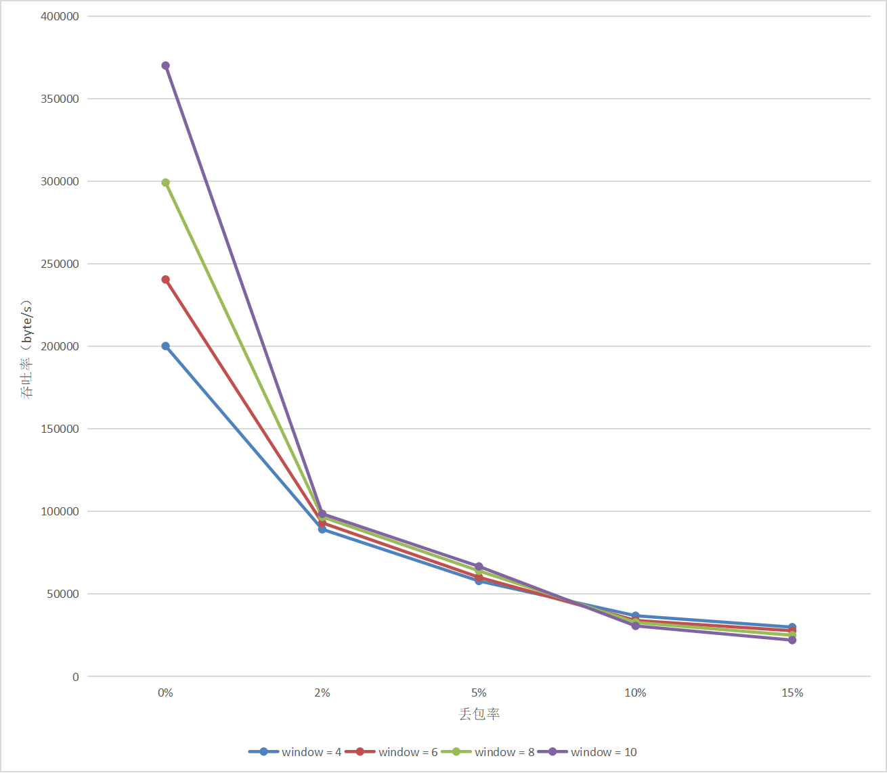
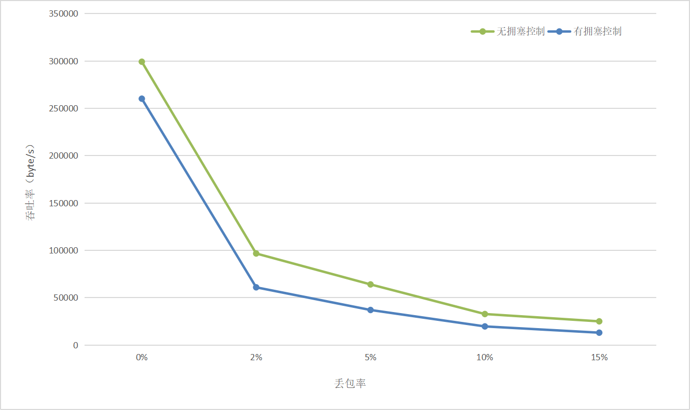

# 编程作业3-4实验报告 # 
## 实验名称：基于UDP服务设计可靠传输协议并编程实现 ##
#### 2011181 唐鹏程 ####
&nbsp;

## 一. 实验要求 ##

基于给定的实验测试环境，通过改变延迟时间和丢包率，完成下面3组性能对比实验：

（1） 停等机制与滑动窗口机制性能对比；

（2） 滑动窗口机制中不同窗口大小对性能的影响；

（3） 有拥塞控制和无拥塞控制的性能比较。

## 二. 实验过程 ##

##### 1. 停等机制与滑动窗口机制性能对比
我选用大小最为合适的1.jpg和2.jpg作为传输文件，控制传输延迟为10ms，丢包率为1%，选用窗口大小为6，然后分别进行测试后传输时间如下所示：

|文件 | 停等机制 | 滑动窗口 |
|-----| -------- | -------- |
|1.jpg| 16.744 s | 17.220 s |
|2.jpg| 52.031 s | 54.618 s |

吞吐率结果如下所示：

|文件 | 停等机制      | 滑动窗口      |
|-----| ------------- | ------------- |
|1.jpg| 110926 byte/s | 107860 byte/s |
|2.jpg| 113365 byte/s | 107996 byte/s |

可以看出停等机制和滑动窗口机制的传输性能其实相差不大，甚至滑动窗口的性能要略微差于停等机制。我觉得原因主要在于GBN滑动窗口机制在处理丢包后的超时重传时有相对较大的性能损耗，因为要进行大量的重传，所以丢包率过高会导致滑动窗口机制性能较差，于是我将路由程序的丢包率设置为0.1%，延时设置为0ms，得到如下结果：

|文件 | 停等机制 | 滑动窗口 |
|-----| -------- | -------- |
|1.jpg| 5.316 s | 4.699 s |
|2.jpg| 15.715 s | 15.547 s |

|文件 | 停等机制      | 滑动窗口      |
|-----| ------------- | ------------- |
|1.jpg| 349389 byte/s | 395266 byte/s |
|2.jpg| 375342 byte/s | 379398 byte/s |

可以看出和猜想相符，但丢包率降低时，GBN滑动窗口的优势才逐渐显现，当文件较小时相较于停等机制有明显的性能提升。因此可以得到结论，当丢包率较小的时候，GBN的性能优于停等机制；而当丢包率较高的时候，GBN由于存在较大的重传开销，导致性能下降，此时GBN的性能不如停等机制。

##### 2. 滑动窗口机制中不同窗口大小对性能的影响
介于上一部分我得出结论丢包率会影响GBN滑动窗口机制的性能，接下来就将测试滑动窗口机制中不同丢包率下不同窗口大小性能的区别，我选用了4，6，8，10这4个窗口大小进行测试，传输文件选用1.jpg，延时统一为1ms，得到如下所示图表：

从中可以看出，当丢包率较小的时候，吞吐量随着窗口大小的增加而显著提升，而随着丢包率的上升，吞吐量随窗口大小的变化而产生的变化逐渐减小，以至于产生负影响。主要原因是丢包率较小时，超时重传很少发生，GBN由于在重传时需重传所有缓冲区数据包，所以对性能有很大损耗，因此性能随着窗口大小的增加而提升。而随着丢包率的上升，窗口大小带来的收益逐渐反转，当丢包率达到10%以上的时候，滑动窗口越大，性能越差，原因就是丢包率较大，会产生大量超时重传，时间开销越大，因此性能越差。

##### 3. 有拥塞控制和无拥塞控制的性能比较
为了比较有拥塞控制和无拥塞控制的GBN滑动窗口机制的性能，我仍然研究丢包率对其的影响，控制滑动窗口为6，调整丢包率大小，绘制出下图：

从中可以看出，有点意外的是，增加拥塞控制之后，传输性能不但没有得到提升，还降低了很多，在丢包率达到10%之后性能只有无拥塞控制时的一半。这很出乎意料，因为拥塞控制直观上是一种随情况调整的性能优化算法。我只能进行简要分析和猜想，由于拥塞控制时丢包后进行超时重传时会将cwnd重置为1，且收到3次冗余ACK也会cwnd减半，这会导致接下来一段时间内吞吐量从一个较低的水平逐渐上升，当丢包率较高时这样的情况反复出现，使得拥塞控制的优势————不断增加窗口大小很难实现，这就可能导致了性能的大量损耗。

&nbsp;

###### 源码链接：https://github.com/Donnykk/Computer_Network/tree/main/UDP_ReliableConnection